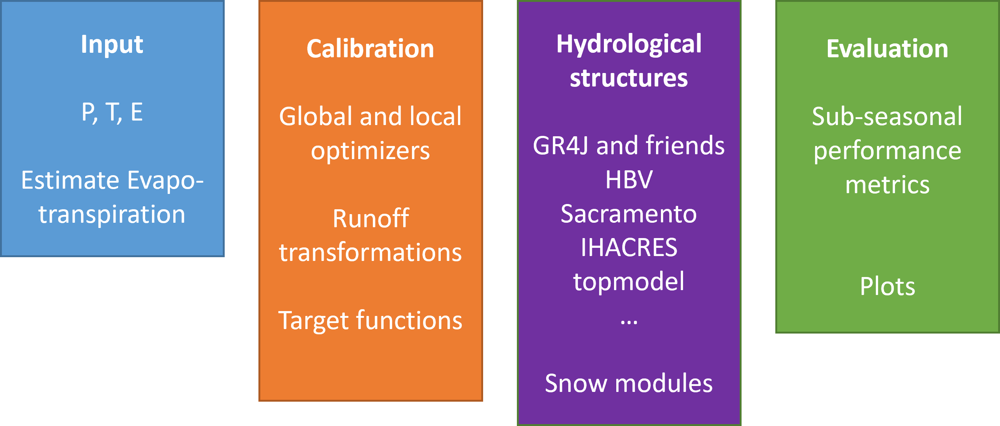

<!-- README.md is generated from README.Rmd. Please edit that file -->

```{r, include = FALSE}
knitr::opts_chunk$set(
  collapse = TRUE,
  comment = "#>",
  fig.path = "man/figures/README-",
  out.width = "100%"
)
```

# openQUARREL

<!-- badges: start -->

<!-- badges: end -->

A Meta-Package Integrating Several Hydrological Model Packages in R.

An R meta-package of lumped conceptual models was developed based on the review of R-packages and the therein stated aim “[…] to run all the packages through the same R architecture” [(Astagneau et al., 2021)](https://doi.org/10.5194/hess-25-3937-2021). So far the models are restricted to daily input. It was called openQUARREL (QUantifying And Reducing uncertainties with an R package providing an Ensemble of hydrological modeLs) and combines hydrological model packages, applies several calibration routines and offers evaluation tool.

It heavily relies on external packages as the [airGR](https://hydrogr.github.io/airGR/index.html), [hydromad](https://hydromad.github.io/index.html), [TUWmodel](https://rdrr.io/cran/TUWmodel/man/TUWmodel.html) and [topmodel](https://github.com/ICHydro/topmodel) with their hydrological models. Similarly, for calibration external packages are integrated as [DEoptim](https://cran.r-project.org/web/packages/DEoptim/index.html), [hydroPSO](https://github.com/hzambran/hydroPSO) and others. For objective functions it uses the [hydroGOF](https://cran.r-project.org/web/packages/hydroGOF/index.html) package, and applies the great plots of [airGR](https://hydrogr.github.io/airGR/index.html) to models of other packages.



## Installation

Currently, it is dependent on airGR version 1.6.12 and hydromad 0.9-26. The author is currently contacting the developers to also being able to include their newest versions. The hydromad package is automatically installed from their github folder using the [oldstable](https://github.com/hydromad/hydromad/tree/oldstable) branch. The airGR package version 1.6.12 needs to be installed from CRAN archive like this, previously to the installation of openQUARREL:

```{r install airGR, eval=FALSE}
install.packages("https://cran.r-project.org/src/contrib/Archive/airGR/airGR_1.6.12.tar.gz", repos = NULL, type = "source")
```

Similarly, topmodel was recently removed from CRAN and can be installed like so:

```{r install topmodel, eval=FALSE}
install.packages("https://cran.r-project.org/src/contrib/Archive/topmodel/topmodel_0.7.5.tar.gz", repos = NULL, type = "source")
```

Now you can install openQUARREL. 
**Note:** Choose "3: None" after the prompt to not update your packages after this command as this will also update airGR (on CRAN) and hydromad (on github).

```{r install openQUARREL, eval=FALSE}
remotes::install_github("mw-schirmer/openQUARREL", dependencies = TRUE)
```

## Example

This is a basic example which shows you how to run some hydrological models `vignette("run_model_minimalistic")`.

## Your contribution

If you want your model to be included I simply need a code snippet as for example done in the [assets of (Astagneau et al., 2021)](https://github.com/hydroGR/hydroModPkgR-article). Here they provided an example on how to [prepare data and run a model with the TUWmodel package](https://github.com/hydroGR/hydroModPkgR-article/blob/master/hydromad_mountainous.R).
