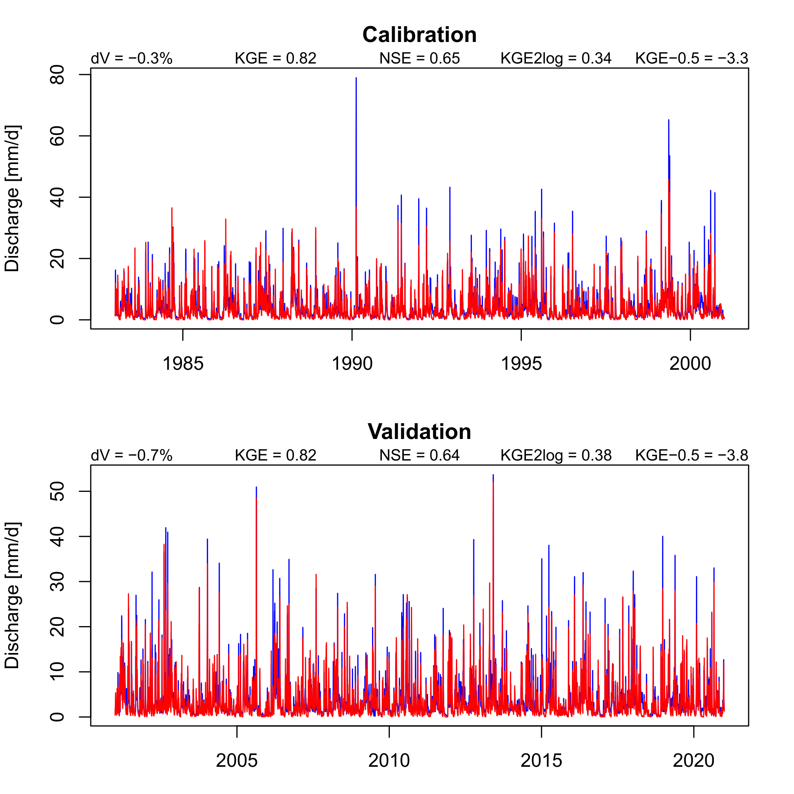
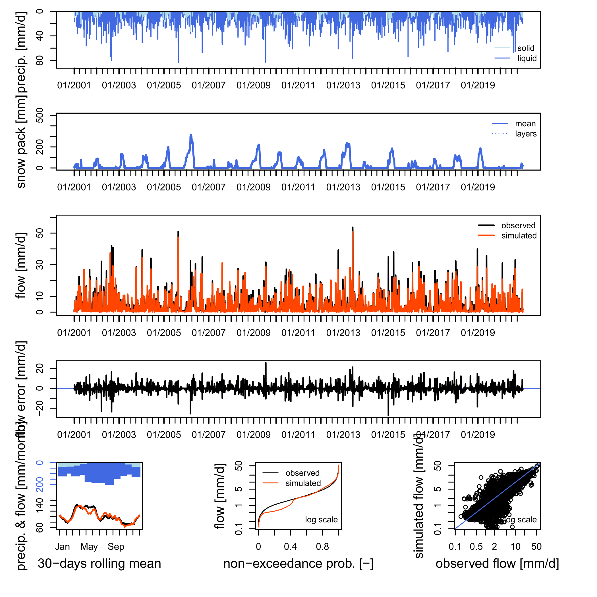

```{r setup, include=FALSE}
knitr::opts_chunk$set(
  collapse = TRUE,
  comment = "#>"
)


```


This vignette shows how to calibrate and validate a hydrological model

## Preparations

Do `vignette("run_model_minimalistic")` for data loading.

```{r first_vignette, include=FALSE}
source("run_model_minimalistic.R")
```


We now need additionally the hydroGOF package.

**Note:** the warning of deprecated packages can be ignored, openQUARREL is using only
non-affected parts of hydroGOF.
```{r packages_new}
library(hydroGOF)
```


... and observed streamflow (column Qmm) from the example data set.

```{r Qobs}
minimum_input <- input_data %>% 
  filter(HSU_ID == "2303") %>% 
  select(DatesR, Qmm) %>%
  inner_join(minimum_input, join_by(DatesR))
```


Define periods for warm-up, calibration and validation:

``` {r split indices}
# split data set
split_indices <- split_data_set(
  minimum_input,
  c("1981-01-01", "1982-12-31", # warm up
    "1983-01-01", "2000-12-31", # calibration
    "2001-01-01", "2020-12-31") # validation
)
```


## Calibration 

Choose the calibration function, 
the error criterion and streamflow transformation applied (here `KGE` and `none` separated by a `__`),
and whether you want to transform parameters to a hypercube.

```{r calibration_settings}
cal_fn <- "steepest_descent"

error_crit_transfo <- "KGE__none"
do_transfo_param <- TRUE
```


Put basin information in a list.
(todo: some redundancy with input, needs to be solved in future releases)
```{r hydro_data}
hydro_data <- list()
hydro_data$BasinObs <- minimum_input

# todo: also this needs to be updated for topmodel for example
minimum_basin_info <- basin_data[["2303"]]
# todo: delete HypsoData in general
minimum_basin_info$HypsoData <- NULL
hydro_data$BasinInfo <- minimum_basin_info
```


Calibrate the model.

```{r calibrate}
# calibrate the model
calibration_results <- calibrate_model(
  hydro_data, split_indices, model, input,
  cal_fn = cal_fn, do_transfo_param = do_transfo_param
) %>% suppressWarnings() %>% suppressMessages()
```


Show calibration results:

Calibration finished in `r calibration_results$duration %>% as.numeric()` sec with best criterion `r calibration_results$error_crit_val` with the model parameters:


```{r calibration_results}
# get the parameter names and print
names(calibration_results$model_param) <- default_cal_par[[model]]$lower
print(calibration_results$model_param)
```


There is more information after calibration, `calibration_results` is a list of 
storing also under the entry `more_info` output of the chosen calibration function.

```{r calibration_results_all}
str(calibration_results)
```

Simulate model, similar to `vignette("include_snow_module")`, but now applying the calibrated parameters.

```{r simulate_model}
# simulate snow, if an external snow module is needed (not here, but when you change it)
# todo: this update process can be put in one function
if (exists("snow_module")) {
  if (!is.null(snow_module)) {
    
    # create input
    snow_input <- create_input(snow_module, minimum_input, list()) %>% 
      suppressWarnings() %>% suppressMessages()
    
    # simulate snow
    snow_module_results <- simulate_snow(snow_module, snow_param, snow_input) %>% 
      suppressWarnings() %>% suppressMessages()
    
    # update precip
    input$P <- snow_module_results$surface_water_runoff
    
  }
}

# run model
# Note: we put Qobs as input to have it available for airGR plots
sim <- simulate_model(model, calibration_results$model_param, input, Qobs = hydro_data$BasinObs$Qmm)

# merge snow module results with hydro model results
if (exists("snow_module_results")) {
  sim <- merge_snow_runoff_sim(sim, snow_module_results) 
}

```

## Validation

### Plots

For validation there are two plots available which can be right now only only saved to disc as pdf 
(which will be changed in a future release).

The first is a simple plot showing simulated and observed streamflow with some indicators for both 
the calibration and validation period, simulated streamflow is red.

``` {save cal_val_plot, eval=FALSE}
# define and create a output folder
output_folder <- "output"
dir.create(output_folder)

save_cal_val_plot(file.path(output_folder, "cal_val_plot.pdf"), hydro_data$BasinObs, sim$Qsim, split_indices)
```





The second plot is the great [airGR::plot](https://rdrr.io/cran/airGR/man/plot.OutputsModel.html)
adapted to models from other packages. We plot it for the calibration and validation period
separately.

``` {r airGR_plots, eval=FALSE}
# airGR plots for validation and calibration time period

# calibration period
save_airGR_plot(file.path(output_folder, "airGR_cal.pdf"), model, sim, split_indices$ind_cal, hydro_data) %>% 
  suppressWarnings() %>% suppressMessages()
# validation period
save_airGR_plot(file.path(output_folder, "airGR_val.pdf"), model, sim, split_indices$ind_val, hydro_data) %>% 
  suppressWarnings() %>% suppressMessages()
```

Here is the validation plot shown:



It seems that this model has difficulties in spring with snow melt, quite probably because of a missing snow covered fraction parameterisation. Try this with the model `CemaNeigeGR4J` as this snow module has such a parameterisation implemented.

### Calculation of (sub)seasonal performance metrics

Define metrics with streamflow transformations, separated by `__`. 
For example `mae__power__-0.5` is the mean absolute error calculated with 
[hydroGOF::mae](https://rdrr.io/cran/hydroGOF/man/mae.html), and using a power 
transformation with exponent -0.5.

**Note:** All these (and other) string combinations can also be used for calibration with applying it to `error_crit_transfo`. 

``` {r def_val_crit} 
# validation settings
val_crit_transfo <- c("KGE__none", "NSE__none", "VE__none", "pbias__none", "mae__none", "mse__none",
                      "KGE__power__0.2",  "NSE__power__0.2", "mae__power__0.2", "mse__power__0.2",
                      "KGE__boxcoxsantos", "NSE__boxcoxsantos", "mae__boxcoxsantos", "mse__boxcoxsantos",
                      "KGEtang__log", "NSE__log", "mae__log", "mse__log",
                      "KGE__power__-0.5", "NSE__power__-0.5", "mae__power__-0.5", "mse__power__-0.5")
```

Define the subseasons for which the above defined metrics are calculated for:

``` {r val_subseason}
# a list with names and arrays of two digits describing months used to calculate
# subseasonal validation metrics
val_subseason <- list(spring = c("02", "03", "04", "05"), 
                      summer = c("06", "07", "08", "09"))
```

Calculate (sub)seasonal metrics. It will automatically calculate performance metrics for the whole year (all).

``` {r calc_perf}
# calculate performance metrics for calibration period
perf_cal <- calc_subseasonal_validation_results(val_subseason, hydro_data$BasinObs$DatesR,
                                                split_indices$ind_cal, "calibration",
                                                col_name = "period",
                                                sim$Qsim, hydro_data$BasinObs$Qmm, val_crit_transfo
)

# calculate performance metrics for calibration period
perf_val <- calc_subseasonal_validation_results(val_subseason, hydro_data$BasinObs$DatesR,
                                                split_indices$ind_val, "validation",
                                                col_name = "period",
                                                sim$Qsim, hydro_data$BasinObs$Qmm, val_crit_transfo
)

# combine periods in one data frame
perf_df <- dplyr::bind_rows(perf_cal, perf_val)
```

Show the results which is a tibble. Lambda is the exponent if a power transformation is used ...
```{r show_table}
knitr::kable(head(perf_df))
```

This result can be stored as ascii file:

``` {r save_ascii, eval=FALSE}
# write ascii results overview
write_ascii(
  file.path(output_folder, "perf_ascii.txt"),
  # to include also the parameters
  calibration_results, 
  perf_df
)
```

All results can be stored as a binary

``` {r save_binary, eval=FALSE}
# for this split sim in calibration and validation periods
sim_list <- list()
sim_list$cal <- subset_simulations(split_indices$ind_cal, sim)
sim_list$val <- subset_simulations(split_indices$ind_val, sim)

saveRDS(
  list(
    calibration = calibration_results,
    simulation_val = sim_list$val,
    simulation_cal = sim_list$cal,
    sim_more_info = sim_list$more_info,
    validation = validation_results
  ),
  file.path(output_folder, "results_binary.rds")
)
```

## Next steps
Choose a different model, or a snow module/hydrological model combination,
or a different calibration function (see `vignette("calibration_methods_overview")` for a complete list), or a different streamflow transformation for calibration 
(e.g. `error_crit_transfo <- "NSE__power__0.2"`) or do it in a different subbasin 
with filtering the example data to a different HSU_ID.
